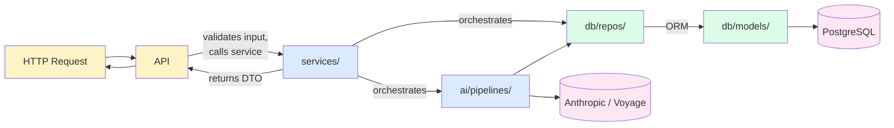
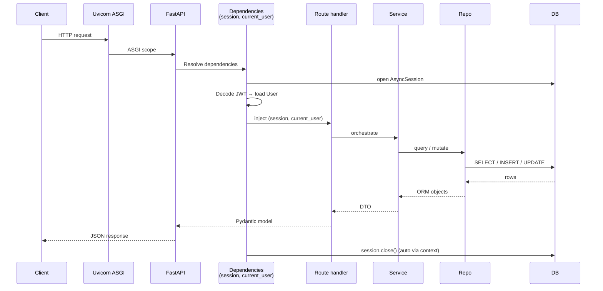

# Backend Architecture

> **Stack:** FastAPI · SQLAlchemy 2 (async) · Pydantic 2 · Alembic · PostgreSQL 16 + pgvector
> **Runtime:** Python 3.12, `uv` for dependency management, Uvicorn ASGI server.

---

## 1. Layering & Folder Structure

```
backend/
├── app/
│   ├── main.py                    FastAPI app, CORS, router mounts, lifespan
│   ├── core/
│   │   ├── config.py              Pydantic Settings (env-driven)
│   │   ├── security.py            JWT encode/decode, bcrypt
│   │   └── deps.py                FastAPI dependencies (session, current_user, role gates)
│   ├── api/                       HTTP layer (thin)
│   │   ├── auth.py                /auth/* — login, token, me
│   │   ├── employees.py           /employees/* — directory + profile CRUD
│   │   ├── skills.py              /skills/* — catalog + gap analysis
│   │   ├── uploads.py             /uploads/* — resume PDF + text
│   │   ├── review.py              /review-queue/* — HR review workflow
│   │   └── search.py              /search — semantic search
│   ├── services/                  Business orchestration
│   │   ├── auth.py                authenticate, issue_token
│   │   ├── employees.py           list/get/update/delete employee
│   │   ├── ingestion.py           PDF/text → extraction → review queue
│   │   └── review.py              List, edit, approve, reject
│   ├── ai/
│   │   ├── client.py              AsyncAnthropic singleton
│   │   ├── embeddings.py          Voyage AI async wrapper
│   │   ├── pipelines/
│   │   │   ├── extraction.py      Resume → StructuredProfile
│   │   │   ├── inference.py       Skill inference (rules + Haiku)
│   │   │   └── search.py          NL query → ranked candidates
│   │   └── prompts/
│   │       ├── extract_resume.py  System prompt + EXTRACT_PROFILE_TOOL
│   │       ├── infer_skills.py    System prompt + INFER_SKILLS_TOOL
│   │       ├── parse_query.py     System prompt + PARSE_QUERY_TOOL
│   │       └── rerank_reason.py   System prompt + RERANK_TOOL
│   ├── db/
│   │   ├── session.py             AsyncSession factory
│   │   ├── base.py                DeclarativeBase
│   │   ├── models/                ORM (User, Employee, Skill, EmployeeSkill, …)
│   │   └── repos/                 Data access (employees, embeddings)
│   ├── schemas/                   Pydantic DTOs (request/response shapes)
│   └── seed/                      Demo seeders
├── alembic/                       Migrations (env.py + versions/001_initial_schema.py)
├── tests/                         pytest + pytest-asyncio
├── pyproject.toml                 Deps + Ruff config
└── Dockerfile                     Python 3.12 + uv
```

---

## 2. Layer Responsibilities



### `api/` — HTTP boundary

- One router per resource.
- Validates input with Pydantic.
- Reads request, calls a service, returns a response.
- Uses `Depends(get_current_user)`, `Depends(require_hr)` for auth.
- **No business logic. No SQL. No AI calls.**

### `services/` — orchestration

- Combines repos + AI pipelines.
- Owns the transaction lifecycle.
- Returns DTOs (Pydantic models, not ORM objects).
- Catches domain exceptions and translates them.

### `ai/pipelines/` — AI orchestration

- Pure async functions over `AsyncSession + inputs → outputs`.
- Composes prompt builders, tool calls, fallback strategies.
- Uses `tenacity` for retry policies on transient API failures.

### `db/repos/` — data access

- All SQL lives here.
- Eager-load relations with `selectinload` / `joinedload` to prevent N+1.
- `pgvector` queries use raw SQLAlchemy `text()` for the `<=>` operator.

### `db/models/` — schema

- ORM declarations.
- Relationships, foreign keys, constraints.
- `Mapped[...]` typed columns (SQLAlchemy 2 style).

### `schemas/` — DTOs

- Pydantic v2 models.
- Request and response shapes per endpoint.
- Internal extraction shapes (`StructuredProfile`, `ParsedQuery`) for type-safe AI pipeline outputs.

---

## 3. Request Lifecycle



---

## 4. Dependencies (`core/deps.py`)

| Dependency | Returns | Purpose |
|---|---|---|
| `get_session` | `AsyncSession` | Per-request DB session (yields, closes on completion). |
| `oauth2_scheme` | `str` | Extracts bearer token from `Authorization` header. |
| `get_current_user` | `User` | Decodes JWT, loads user. Raises 401 on failure. |
| `require_hr` | `User` | Wraps `get_current_user`, raises 403 if role ≠ `hr`. |
| `require_employee` | `User` | Same but role = `employee`. |
| `require_any` | `User` | Allows either role. |

Usage:

```python
@router.get("/search")
async def search(
    request: SearchRequest,
    session: SessionDep,
    current_user: Annotated[User, Depends(require_hr)],
):
    return await run_search(session, request, current_user)
```

---

## 5. Database Layer

### Session factory (`db/session.py`)

```python
engine = create_async_engine(settings.database_url, pool_pre_ping=True, ...)
SessionLocal = async_sessionmaker(engine, expire_on_commit=False)
```

`expire_on_commit=False` is critical: it lets ORM objects remain usable after commit, which simplifies returning them in API responses.

### Models (`db/models/`)

All models inherit from `db.base.Base` (DeclarativeBase). Conventions:

- UUID primary keys via `Mapped[UUID]` with `default=uuid4`.
- Server-default timestamps (`server_default=now()`).
- Relationships use `selectin` lazy loading by default, with explicit `cascade="all, delete-orphan"` on parent→child.
- Junction table `employee_skills` carries proficiency metadata (years, source, confidence, evidence).

Full table reference: [Database Schema](./database.md).

### Repos (`db/repos/`)

| File | Key Functions |
|---|---|
| `employees.py` | `load_skill_catalog`, `find_or_create_skill`, `upsert_from_extraction` |
| `embeddings.py` | `render_profile_summary`, `upsert_employee_embedding`, `vector_search`, `load_employee_for_rerank` |

`vector_search` is the heart of hybrid search — it builds a single SQL query combining:

- `1 - (emb.vector <=> :query)` for cosine similarity (HNSW-accelerated).
- `WHERE availability IN (...)` for hard availability filter.
- `WHERE location ILIKE '%term%'` for location.
- `EXISTS (SELECT 1 FROM employee_skills WHERE …)` for per-skill min-years constraints.

---

## 6. AI Layer (`ai/`)

### Client singleton (`ai/client.py`)

```python
_client: AsyncAnthropic | None = None
def get_anthropic_client() -> AsyncAnthropic:
    global _client
    if _client is None:
        _client = AsyncAnthropic(api_key=settings.anthropic_api_key)
    return _client
```

Single async client reused across the process. Connection pool is handled by `httpx` under the hood.

### Prompts (`ai/prompts/`)

Each prompt module exports:

- A **system prompt** (sometimes built dynamically — e.g., extraction injects the canonical skill catalog).
- A **tool schema** (the `tool` dict the Anthropic API expects).
- One or more **message builder functions** that produce user-message content.

All tools are forced via `tool_choice={"type": "any"}` or `tool_choice={"type": "tool", "name": "..."}` to guarantee structured output.

### Pipelines (`ai/pipelines/`)

| File | Entry | Models used | Output |
|---|---|---|---|
| `extraction.py` | `run_extraction_pipeline(session, text, *, employee_id)` | Sonnet 4.6 | `StructuredProfile` + side effects (DB rows + embedding) |
| `inference.py` | `infer_skills(extracted_skills, *, project_context)` | Haiku 4.5 | `list[InferredSkill]` |
| `search.py` | `run_search(session, query, *, top_k)` | Haiku (parse) + Voyage (embed) + Sonnet (re-rank) | `SearchResponse` |

See: [AI Overview](../ai/overview.md), [Ingestion](../ai/resume-ingestion.md), [Search](../ai/semantic-search.md).

---

## 7. Configuration (`core/config.py`)

`pydantic-settings` `Settings` class. Reads from process env + a `.env` file.

| Setting | Default | Source |
|---|---|---|
| `database_url` | _required_ | env |
| `jwt_secret` | _required_ | env |
| `jwt_algorithm` | `HS256` | env |
| `jwt_expire_minutes` | `1440` | env |
| `anthropic_api_key` | _required_ | env |
| `voyage_api_key` | _required_ | env |
| `extraction_model` | `claude-sonnet-4-6` | env |
| `light_model` | `claude-haiku-4-5-20251001` | env |
| `rerank_model` | `claude-sonnet-4-6` | env |
| `embedding_model` | `voyage-3-large` | env |
| `embedding_dim` | `1024` | constant |
| `search_top_k_retrieval` | `20` | constant |
| `search_top_k_final` | `8` | constant |
| `upload_dir` | `uploads/` | constant |
| `max_resume_size_mb` | `10` | constant |

The `Settings()` instance is constructed once and imported wherever needed:

```python
from app.core.config import settings
```

---

## 8. Security (`core/security.py`)

```mermaid
flowchart LR
    LOGIN[/auth/login] -->|bcrypt verify| HASH[(password_hash)]
    LOGIN -->|on success| MINT[jwt.encode]
    MINT -->|HS256<br/>1d exp| TOKEN[JWT]
    TOKEN -->|client stores in<br/>localStorage| BROWSER[Browser]
    BROWSER -->|Authorization: Bearer| REQ[Subsequent requests]
    REQ -->|jwt.decode| DECODE
    DECODE -->|sub → User| USER[(users)]
    USER -->|role check| ROLE[require_hr / require_employee]
```

| Concern | Implementation |
|---|---|
| Password storage | `passlib[bcrypt]`, cost factor default. |
| Password verification | `pwd_context.verify` — constant-time bcrypt compare. |
| Token signing | `python-jose` HS256 (configurable). |
| Token claims | `{ sub: user_id, role, iat, exp }`. |
| Token expiry | 1440 minutes (24 hours), configurable. |
| Role enforcement | FastAPI `Depends` chain — fails fast at the framework boundary. |

Production hardening notes in [Production Deployment](../guides/production-deployment.md#secrets--auth).

---

## 9. Schemas (`schemas/`)

Pydantic v2 throughout. Three flavors:

1. **Request DTOs** (`LoginRequest`, `SearchRequest`, `ProfileEditRequest`) — what the client sends.
2. **Response DTOs** (`TokenResponse`, `EmployeeDetail`, `SearchResponse`) — what the API returns.
3. **Internal AI DTOs** (`StructuredProfile`, `ParsedQuery`, `ExtractedSkill`) — tool_use output shapes; reused by pipelines and persisted to `resume_uploads.extracted_payload` for the diff view.

Every endpoint annotates its request and response, which gives:

- Auto-validation and 422 errors with field-level detail.
- Auto-generated OpenAPI / Swagger at `/docs`.
- Type-safe service signatures.

---

## 10. Error Handling

| Layer | Pattern |
|---|---|
| API | `HTTPException(status_code, detail)`. Pydantic raises 422 automatically on validation. |
| Services | Raise domain exceptions (`UnauthorizedError`, `NotFoundError`). API translates to HTTP. |
| AI calls | `tenacity` retry (`@retry(stop=stop_after_attempt(2), wait=wait_exponential(2, 8))`). |
| DB | `IntegrityError` surfaces as 409; constraint violations get human-readable messages. |
| Ingestion failure | `ResumeUpload.status = 'failed'` + `error` field. Never silently lost. |

Full taxonomy: [Error Handling](../operations/error-handling.md).

---

## 11. Async Discipline

- **Every** I/O call is async — DB queries, HTTP requests, file I/O via `aiofiles` where possible.
- **No** sync DB calls inside async handlers.
- **No** blocking sleeps; use `asyncio.sleep`.
- File reads of small files (resume bytes) are done synchronously (acceptable for hot path with bounded size).

---

## 12. Migrations

Alembic with async engine. The `alembic/env.py` is configured for `AsyncEngine`.

```bash
# Generate a new migration after model changes
docker compose exec backend uv run alembic revision --autogenerate -m "describe change"

# Apply pending migrations
docker compose exec backend uv run alembic upgrade head

# Rollback one revision
docker compose exec backend uv run alembic downgrade -1
```

Migration `001_initial_schema.py` is comprehensive — it creates all tables, indexes (including the HNSW vector index), and the three extensions (`vector`, `uuid-ossp`, `pg_trgm`).

---

## 13. Lifespan / Startup

`main.py` defines a FastAPI lifespan handler that:

1. Validates database connectivity.
2. Logs the configured AI models for the demo.

The seed scripts (`seed_demo`, `seed_employees`) are **not** invoked from lifespan. They are explicit one-shot commands run inside the container so demo data state is predictable.

---

## 14. Design Decisions (TL;DR)

| Decision | Rationale |
|---|---|
| **Async-first** | Aligns with Anthropic + Voyage async SDKs; allows hundreds of concurrent requests without blocking. |
| **Repo pattern** | One place to optimize / change SQL; trivial to unit-test the rest of the app with a fake repo. |
| **Pipelines as functions, not classes** | They are stateless and side-effectful — no state to hide behind a class. Easy to compose and test. |
| **`expire_on_commit=False`** | DTOs are mostly derived from ORM objects; relationship access after commit shouldn't trigger refresh. |
| **No celery/queue for ingestion (yet)** | Synchronous extraction gives the user real-time feedback in the upload UI. Moving to a queue is a known follow-up — see [Roadmap](../roadmap.md). |
| **`tool_use` over JSON-mode** | Tools give us **typed schemas** the model is trained to honor; JSON-mode is freeform and fragile. |
| **`tenacity` retry** | Anthropic / Voyage APIs are reliable but not perfectly so. Two attempts with exponential backoff hide transient blips from the user. |

---

_Next: [Frontend Architecture](./frontend.md) · [Database Schema](./database.md) · [Deployment](./deployment.md)_
