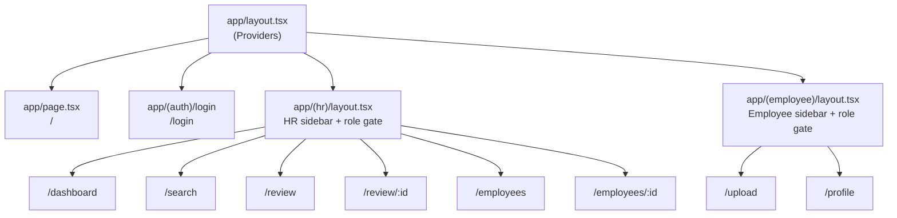
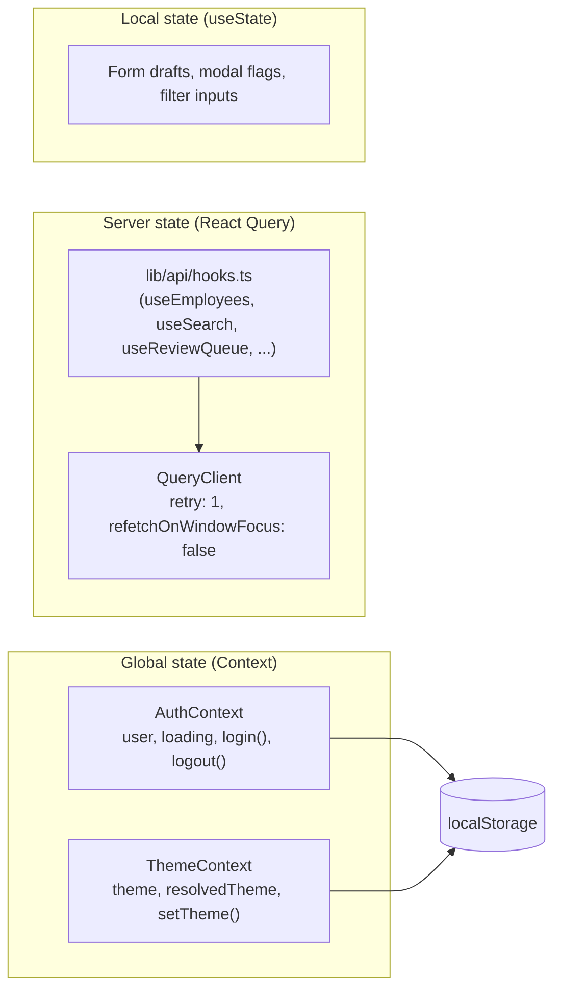
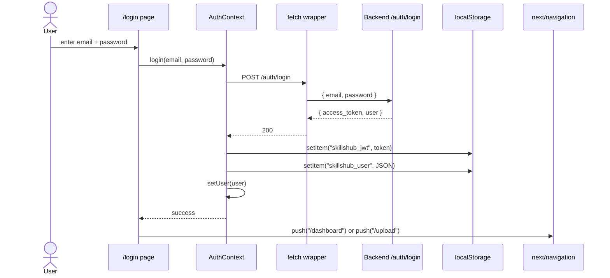

# Frontend Architecture

> **Stack:** Next.js 15 (App Router) · React 19 · TypeScript 5 · TailwindCSS 4 · React Query 5
> **Tooling:** pnpm 9.15, Node 22, ESLint, `next lint`, `tsc --noEmit`
> **Package manager in container:** pnpm via Corepack

---

## 1. Goals

| Goal | How |
|---|---|
| **Role-driven UX** | Route groups isolate HR vs. Employee experiences. |
| **Optimistic + cached server state** | React Query for fetch, mutate, invalidate. |
| **Type safety end-to-end** | Strict TypeScript, typed routes (`experimental.typedRoutes: true`), Pydantic-mirrored TS types. |
| **Dark mode** | System-aware, no white-flash via inline pre-hydration script. |
| **Demo-friendly** | Real-time polling on the review queue (15 s) so HR sees uploads land. |

---

## 2. Folder Layout

```
frontend/
├── app/                                  Next.js App Router
│   ├── layout.tsx                        Root layout (Providers, fonts, theme script)
│   ├── page.tsx                          Landing page (marketing hero, CTA)
│   ├── globals.css                       Global styles + theme tokens
│   ├── (auth)/
│   │   └── login/page.tsx                /login
│   ├── (hr)/                             Protected — role: hr
│   │   ├── layout.tsx                    Sidebar, role gate, mobile nav
│   │   ├── dashboard/page.tsx            /dashboard (stats + gap analysis)
│   │   ├── search/page.tsx               /search (NL talent search)
│   │   ├── review/page.tsx               /review (queue list)
│   │   ├── review/[id]/page.tsx          /review/:id (detail + approve/reject)
│   │   ├── employees/page.tsx            /employees (directory)
│   │   └── employees/[id]/page.tsx       /employees/:id (profile detail)
│   └── (employee)/                       Protected — role: employee
│       ├── layout.tsx                    Sidebar (Upload, My Profile)
│       ├── upload/page.tsx               /upload (PDF + text)
│       └── profile/page.tsx              /profile (own profile, read-only)
├── components/
│   ├── providers.tsx                     QueryClient + Auth + Theme providers
│   ├── search/
│   │   ├── ResultCard.tsx                Candidate card with ScoreRing
│   │   └── ScoreRing.tsx                 SVG circular score gauge
│   ├── skills/
│   │   └── SkillChip.tsx                 Skill badge (category color + proficiency dot)
│   └── ui/
│       ├── Skeleton.tsx                  Loading skeletons
│       └── ThemeToggle.tsx               Light / dark / system
├── lib/
│   ├── api/
│   │   ├── client.ts                     fetch wrapper, JWT, ApiError
│   │   └── hooks.ts                      React Query hooks for every endpoint
│   ├── auth/
│   │   ├── context.tsx                   AuthContext + useAuth
│   │   └── session.ts                    localStorage helpers
│   ├── theme/
│   │   └── context.tsx                   ThemeContext + system listener
│   └── utils.ts                          cn() class merger
├── next.config.ts                        reactStrictMode, typedRoutes
├── tsconfig.json                         strict, @/* path alias
├── package.json                          pnpm@9.15.0
└── Dockerfile                            node:22-alpine + pnpm
```

---

## 3. App Router & Route Groups

Next.js [route groups](https://nextjs.org/docs/app/building-your-application/routing/route-groups) are wrapped in `(parens)` and do not affect the URL — they only scope layouts.



The `(hr)` and `(employee)` layouts perform a role check on mount:

```tsx
const { user, loading } = useAuth();
useEffect(() => {
  if (loading) return;
  if (!user || user.role !== "hr") router.push("/login");
}, [user, loading]);
```

If the user lacks the right role, they bounce to `/login`. While `loading` is true, the layout renders `null` to avoid a flash of unauthorized content.

---

## 4. State Management



### React Query

- Single `QueryClient` constructed in `components/providers.tsx`.
- Defaults: `retry: 1`, `refetchOnWindowFocus: false`.
- All hooks live in `lib/api/hooks.ts` and call the typed `api()` client.

### Auth context

- Reads `skillshub_jwt` and `skillshub_user` from `localStorage` on mount.
- `login(email, password)` calls `/auth/login`, persists session, updates state.
- `logout()` clears `localStorage` and hard-redirects to `/login`.

### Theme context

- Tri-state: `"light" | "dark" | "system"`.
- Listens to `prefers-color-scheme` media query when in `system` mode.
- Inline script in `app/layout.tsx` reads localStorage **before first paint** to set the `dark` class on `<html>` — prevents the dark-mode flash.

---

## 5. HTTP Client (`lib/api/client.ts`)

```ts
// Roughly:
export async function api<T>(path: string, init?: RequestInit): Promise<T> {
  const token = getToken();
  const headers = new Headers(init?.headers);
  if (!(init?.body instanceof FormData)) {
    headers.set("Content-Type", "application/json");
  }
  headers.set("Accept", "application/json");
  if (token) headers.set("Authorization", `Bearer ${token}`);

  const res = await fetch(`${BASE_URL}${path}`, { ...init, headers });
  if (!res.ok) {
    const body = await safeJson(res);
    throw new ApiError(res.status, body?.detail ?? res.statusText, body);
  }
  return (await safeJson(res)) as T;
}
```

Features:

- Pulls JWT from localStorage on every call (no middleware needed for Next.js client components).
- Omits `Content-Type` for `FormData` so the browser sets the multipart boundary correctly.
- Wraps non-2xx in a typed `ApiError(status, message, detail)`.

`NEXT_PUBLIC_API_URL` defaults to `http://localhost:8000`.

---

## 6. React Query Hooks (`lib/api/hooks.ts`)

| Hook | Method | Endpoint | Notes |
|---|---|---|---|
| `useEmployees(q?)` | GET | `/employees?q=` | Directory list, debounced via query key |
| `useEmployee(id)` | GET | `/employees/:id` | Enabled only if id |
| `useMyEmployee()` | GET | `/employees/me` | Logged-in user's profile |
| `useSearch()` | POST | `/search` | Mutation — invalidates nothing (read-only LLM call) |
| `useReviewQueue()` | GET | `/review-queue` | `refetchInterval: 15_000` → live badge |
| `useReviewDetail(id)` | GET | `/review-queue/:id` | Diff view payload |
| `useApprove()` | POST | `/review-queue/:id/approve` | Invalidates `review-queue` + `employees` |
| `useReject()` | POST | `/review-queue/:id/reject` | Invalidates `review-queue` |
| `useUploadResume()` | POST | `/uploads/resume` | FormData; `useEmployee('me')` invalidated |
| `useUploadText()` | POST | `/uploads/text` | JSON body |
| `useSkillsCatalog()` | GET | `/skills/catalog` | `staleTime: Infinity` |
| `useSkillGaps()` | GET | `/skills/gaps` | `staleTime: 60_000` |

Mutations follow this pattern:

```ts
export const useApprove = () => {
  const qc = useQueryClient();
  return useMutation({
    mutationFn: (id: string) => api(`/review-queue/${id}/approve`, { method: "POST" }),
    onSuccess: () => {
      qc.invalidateQueries({ queryKey: ["review-queue"] });
      qc.invalidateQueries({ queryKey: ["employees"] });
    },
  });
};
```

---

## 7. Auth Flow



Logout:

```ts
const logout = () => {
  clearSession();          // remove both localStorage keys
  setUser(null);
  window.location.href = "/login"; // hard redirect to clear all in-memory state
};
```

---

## 8. Theme System

- Three states: `light`, `dark`, `system` (default).
- Resolved at render time and exposed as `resolvedTheme` for components that need it.
- `setTheme(t)` writes to `localStorage['skillshub_theme']` and updates the `dark` class on `<html>`.
- Inline `<script>` in `app/layout.tsx` runs synchronously to set the class before React hydrates, eliminating the dark-mode flash.

CSS uses CSS custom properties (`--color-background`, `--color-foreground`, etc.) that respond to the `.dark` class.

---

## 9. Key Reusable Components

### `SkillChip` (`components/skills/SkillChip.tsx`)

Props: `name`, `category?`, `proficiency?`, `years?`, `inferred?`.

- Category drives background color (language → blue, framework → violet, …).
- Proficiency drives a dot color (expert → emerald, intermediate → amber, novice → slate).
- `inferred` adds a sparkle marker.
- Tooltip shows full metadata.

### `ResultCard` (`components/search/ResultCard.tsx`)

Used on the search page. Composes:

- Rank badge + `ScoreRing` for the match score.
- Name, title, location, availability badge.
- AI reasoning paragraph.
- Top skills as `SkillChip`s.
- Expandable strengths / gaps section.

### `ScoreRing` (`components/search/ScoreRing.tsx`)

Pure SVG circular progress gauge. Color-coded:

| Score | Color |
|---|---|
| ≥ 85 | Green |
| ≥ 65 | Amber |
| < 65 | Red |

Animated via `stroke-dasharray` transition.

### `ThemeToggle` (`components/ui/ThemeToggle.tsx`)

Three variants: `sidebar`, `floating` (top-right pill on marketing pages), `inline` (compact icon-only).

### `Skeleton` family (`components/ui/Skeleton.tsx`)

- `Skeleton` — base animated box.
- `SkeletonCard`, `SkeletonProfile`, `SkeletonTable` — composed placeholders for common layouts.

---

## 10. Page-by-Page

| Route | Component | Highlights |
|---|---|---|
| `/` | `app/page.tsx` | Marketing hero, CTA to login + API docs. |
| `/login` | `app/(auth)/login/page.tsx` | Email/password form, demo creds visible, theme toggle. |
| `/dashboard` | `(hr)/dashboard/page.tsx` | Stats cards, availability chart, pending review list, skill gap panel. |
| `/search` | `(hr)/search/page.tsx` | Query input + sample chips, parsed-query panel, ranked result cards. |
| `/review` | `(hr)/review/page.tsx` | Queue list with skill counts, polls every 15 s. |
| `/review/:id` | `(hr)/review/[id]/page.tsx` | Side-by-side diff, editable fields, approve/reject buttons. |
| `/employees` | `(hr)/employees/page.tsx` | Directory grid, search by name/skill/location. |
| `/employees/:id` | `(hr)/employees/[id]/page.tsx` | Full profile (skills grouped by category, projects, certs). |
| `/upload` | `(employee)/upload/page.tsx` | Drag-drop PDF + text-paste tab, progress UI. |
| `/profile` | `(employee)/profile/page.tsx` | Read-only view of own profile + inferred skill count. |

---

## 11. Sample Data Shapes (TS)

```ts
type Role = "hr" | "employee";

interface SessionUser {
  id: string;
  email: string;
  name: string;
  role: Role;
}

interface SearchResult {
  employee_id: string;
  name: string;
  title?: string;
  location?: string;
  availability: "available" | "partial" | "allocated";
  total_years_exp: number;
  match_score: number;        // 0..100
  reasoning: string;
  strengths: string[];
  gaps: string[];
  top_skills: SkillOut[];
  similarity: number;          // 0..1 (raw cosine)
}

interface SkillOut {
  id: string;
  skill_id: string;
  name: string;
  category: "language" | "framework" | "platform" | "tool" | "domain";
  proficiency: "novice" | "intermediate" | "expert";
  years?: number;
  source: "extracted" | "inferred" | "manual";
  confidence?: number;
  evidence?: string;
}
```

Full API shapes in [API Reference](../api/reference.md).

---

## 12. Notable UX Features

| Feature | Where | Why |
|---|---|---|
| Live review-queue badge | HR sidebar | HR sees uploads land without refresh. |
| Parsed-query panel | `/search` | Transparency — show what the AI understood. |
| Score ring color coding | `ResultCard` | Instant visual signal. |
| Drag-and-drop upload | `/upload` | Reduces friction for first-time users. |
| Approve / reject with inline reason | `/review/:id` | Single screen, no modal. |
| Sample query chips | `/search` | Demo-ready out of the box. |
| Skill gap severity coloring | `/dashboard` | Red/amber/green at a glance. |
| Auto-close mobile drawer | Sidebar | Standard mobile expectation. |
| Dark mode | Everywhere | Sustained-use UI. |

---

## 13. Build & Dev Commands

```bash
pnpm install        # install deps
pnpm dev            # start dev server on :3000
pnpm build          # production build
pnpm start          # production server
pnpm lint           # next lint
pnpm typecheck      # tsc --noEmit
```

---

_Next: [Database Schema](./database.md) · [Service Communication](./service-communication.md)_
