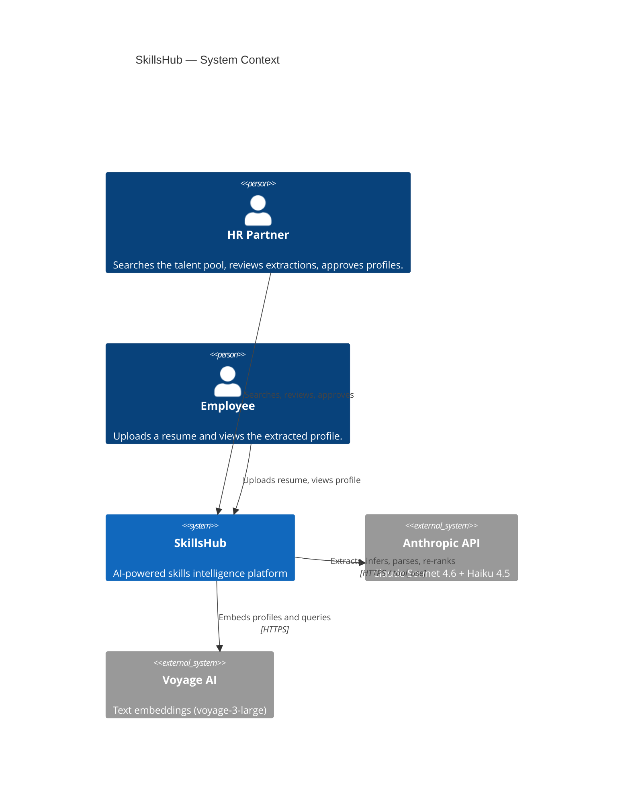
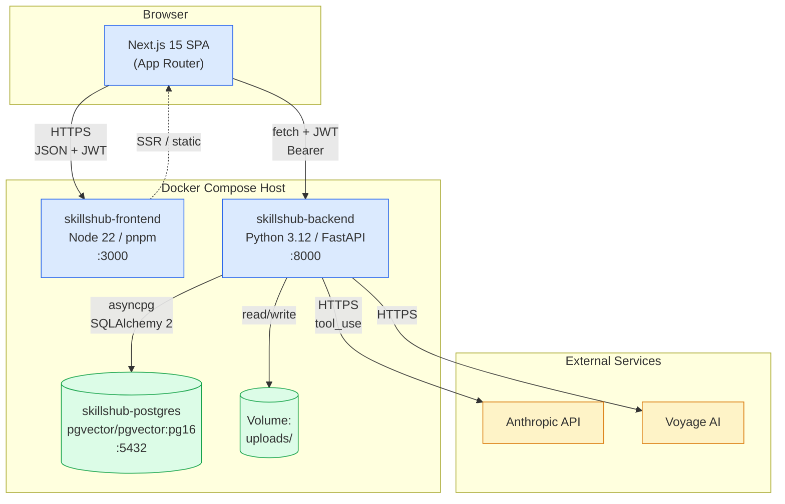
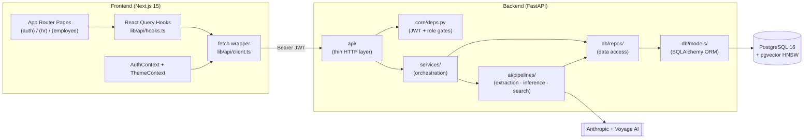
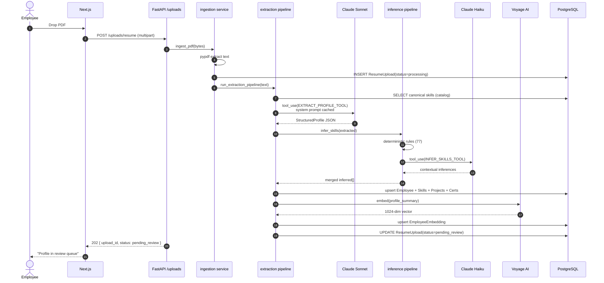
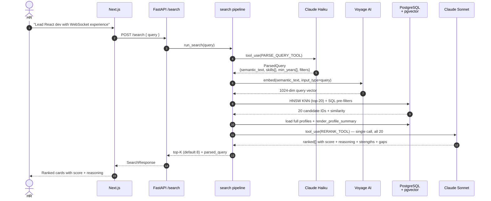

# System Architecture

> **Audience:** New engineers, judges, architecture reviewers.
> **Goal:** Convey the full system in one diagram + a short tour of every component.

---

## 1. Context (C4 Level 1)

---

## 2. Container View (C4 Level 2)

### Containers

| Container | Image / Build | Port | Role |
|---|---|---|---|
| `skillshub-postgres` | `pgvector/pgvector:pg16` | 5432 (host) | Primary OLTP store + vector index |
| `skillshub-backend`  | `./backend/Dockerfile` (python:3.12-slim + uv) | 8001 → 8000 | REST API, AI orchestration |
| `skillshub-frontend` | `./frontend/Dockerfile` (node:22-alpine + pnpm) | 3000 | Next.js dev server (SSR + RSC) |

The `uploads/` directory is bind-mounted into the backend so resume PDFs persist across container rebuilds during dev.

---

## 3. Logical Architecture (Code-Level)

### Strict layering rules (backend)

1. **`api/` is the only HTTP-aware layer.** Routers validate inputs (via Pydantic), call services, return responses. No business logic.
2. **`services/` orchestrates** — composes multiple repos / AI pipelines, owns transactions, returns DTOs.
3. **`ai/pipelines/` owns AI calls** — never invoked directly from `api/`. Pure functions over async session + inputs.
4. **`db/repos/` owns SQL** — every query that touches the DB lives here. Services never assemble SQL inline.
5. **`db/models/` owns the schema** — ORM declarations only. No queries.

Crossing layers (e.g. an API route calling a repo directly) is a smell.

---

## 4. Two Centerpiece Workflows

### 4.1 Resume Ingestion (Smart Profile Extraction)

Full detail: [Resume Ingestion Pipeline](../ai/resume-ingestion.md).

### 4.2 Semantic Search (Natural-Language Talent Discovery)

Full detail: [Semantic Search Pipeline](../ai/semantic-search.md).

---

## 5. Cross-Cutting Concerns

### Authentication
- JWT (HS256), issued by `/auth/login`, 24h expiry, carries `{ sub: user_id, role }`.
- Frontend stores in `localStorage['skillshub_jwt']`, attaches as `Authorization: Bearer`.
- Backend: `Depends(get_current_user)` decodes; `require_hr` / `require_employee` enforce roles.

### Authorization
- Two roles: `hr` and `employee`.
- HR: full read/write across the platform (search, review, employee directory edits).
- Employee: read self, write self, upload self.
- Self-mutation enforced inside the endpoint (employees can `PATCH /employees/{their_own_id}` but not others).

### Configuration
- 12-factor — all config via env. `pydantic-settings` parses `.env` once at startup.
- Sane defaults baked in (e.g. embedding model, JWT algorithm) so the only mandatory vars are secrets and API keys.

### Persistence
- All schema changes via Alembic migrations. The initial migration `001_initial_schema.py` creates extensions (`vector`, `uuid-ossp`, `pg_trgm`) plus all tables and indexes — including the HNSW vector index.
- All writes happen inside an `AsyncSession` (transaction per request) provided by `core/deps.py:get_session`.

### Observability
- `structlog` is wired in. Logs are JSON-friendly. Per-request log context is added at the FastAPI middleware layer.
- See [Observability](../operations/observability.md).

### Error Handling
- All `tool_use` LLM calls retry on transient failure (`tenacity` exponential backoff, 2 attempts).
- Poor PDF text → vision fallback (base64 first 3 pages → Sonnet vision).
- Extraction failure surfaces in the review queue with `status='failed'` and an `error` field, never silently lost.

---

## 6. Technology Choice Rationale

| Decision | Why |
|---|---|
| **FastAPI** over Django / Flask | Async-first, type-driven, auto Swagger, minimal boilerplate. |
| **SQLAlchemy 2 async** | Mature ORM, `asyncpg` driver, eager-load via `selectinload` avoids N+1. |
| **PostgreSQL + pgvector** | One database for OLTP + vector retrieval. No additional infra. ACID on profile writes is non-negotiable. |
| **HNSW index** | Approximate nearest neighbor, `O(log n)` retrieval. Cosine distance for normalized embeddings. |
| **Claude tool_use** | Guarantees structured output (typed JSON), eliminates fragile prompt → JSON parsing. |
| **Dual model** | Sonnet for hard reasoning (extraction, re-rank). Haiku for fast structured tasks (parse, infer). Cost + latency win. |
| **Prompt caching (`cache_control: ephemeral`)** | Extraction system prompt is large + static + reused → caching cuts input cost ~80% and TTFB ~30%. |
| **Voyage `voyage-3-large`** | Best-in-class for technical / code-adjacent text retrieval. |
| **Next.js 15 App Router** | Server + client component split, type-safe routing, fast iteration. |
| **React Query** | Cache + invalidation handled correctly; the only server-state library that scales to dozens of views. |
| **Docker Compose** | One `docker compose up` runs the entire stack for demo and local dev. |

See [Decision Rationale](./backend.md#design-decisions-tldr) for backend-specific decisions.

---

## 7. Boundary Definitions

| Boundary | What crosses | Contract |
|---|---|---|
| Browser ↔ Frontend | Static assets, RSC payloads | Next.js |
| Frontend ↔ Backend | JSON over HTTPS, JWT in `Authorization` header | Pydantic schemas |
| Backend ↔ Database | Async SQL via SQLAlchemy ORM | Alembic-managed schema |
| Backend ↔ Anthropic | `tool_use` API over HTTPS | Tool input/output schemas in `app/ai/prompts/` |
| Backend ↔ Voyage AI | Embedding requests | 1024-dim float vector |
| Backend ↔ Filesystem | Resume PDF blobs | `uploads/{employee_id}/{uuid}.pdf` |

Every external boundary is async and retryable.

---

_Next: [Backend Architecture](./backend.md) · [Frontend Architecture](./frontend.md)_
