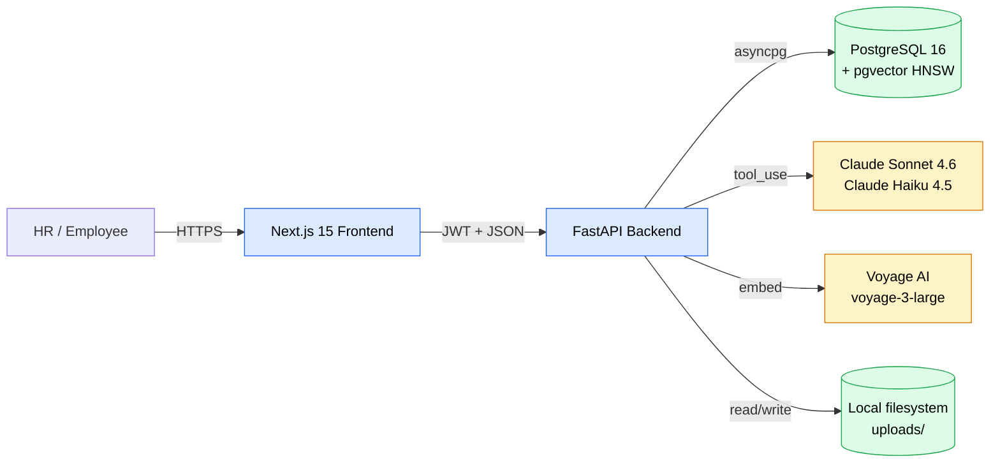

# Project Overview

## What is SkillsHub?

**SkillsHub** is an AI-powered skills intelligence platform that transforms how organizations discover, catalog, and deploy human expertise. It eliminates the friction of finding the right person for the right project by combining structured profile extraction, semantic search, and explainable AI reasoning.

---

## The Problem

In most engineering organizations, skills data lives in three places — none of them useful:

| Where skills live | The cost |
|---|---|
| Scattered spreadsheets | Outdated within weeks |
| Outdated profile pages | Nobody updates them |
| Someone's head | Tribal knowledge, hard to query |

When an HR partner needs to staff a project, they fall back to pinging managers, scanning resumes, and guessing. This means:

- Hidden experts stay hidden.
- Wrong people land on wrong projects.
- Skills inventory is impossible to query.
- Hiring decisions are made without coverage data.

**SkillsHub fixes this** with a system that ingests resumes intelligently, infers implicit knowledge, and answers natural-language questions with ranked, evidence-backed reasoning.

---

## The Solution

SkillsHub solves two hard problems end-to-end:

### Hard Problem #1 — Smart Resume Ingestion

A PDF or text resume enters the system. In ~20 seconds, the platform produces a fully structured, evidence-backed profile:

- **Skills** with proficiency (`novice`/`intermediate`/`expert`), years, source-quoted evidence, and a confidence score.
- **Projects** with role, technologies, dates, and narrative descriptions.
- **Certifications** with issuer and year.
- **Inferred skills** — implicit knowledge surfaced by deterministic rules and contextual LLM reasoning (e.g., a candidate listing _Next.js_ also gets _React_ at 0.97 confidence).

A human-in-the-loop review queue lets HR approve, edit, or reject every extraction before it enters the talent pool.

### Hard Problem #2 — Semantic Natural-Language Search

HR asks a question in plain English. The platform parses intent, applies hard filters, retrieves candidates by vector similarity, then re-ranks with reasoning:

> _"Who can lead a React project with WebSocket experience?"_

Returns ranked candidates with:

- A **match score** (0–100) derived from principled deductions.
- **Plain-English reasoning** citing specific projects and years.
- **Strengths** and **gaps** per candidate.
- The AI's parsed query (skills, min years, location, availability) shown for transparency.

### Stretch — Skill Gap Analysis

The HR dashboard shows live talent pool coverage — which skills are critical/warning/healthy across the organization — with no manual audit required.

---

## Why It's Different

| Approach | Limitation | SkillsHub |
|---|---|---|
| Keyword search | Misses semantic intent | Embedding-based semantic retrieval |
| Pure vector search | No hard filters (location, years) | Hybrid: vector + SQL filters + LLM re-rank |
| Free-text LLM JSON output | Fragile parsing, hallucinations | All LLM calls use **tool_use** for guaranteed schema |
| Single-model architecture | Either slow/expensive or low quality | **Dual-model**: Sonnet for accuracy, Haiku for latency |
| Black-box ranking | "Trust the model" | Evidence + confidence + reasoning per result |
| Auto-ingestion only | No human oversight | Mandatory HR review queue with diff view |

---

## Stack

| Layer | Choice | Why |
|---|---|---|
| **Frontend** | Next.js 15 (App Router), React 19, TypeScript 5, Tailwind 4 | Server/client split, type-safe routing, modern DX |
| **State** | React Query 5 + React Context | Server cache + thin auth/theme state |
| **Backend** | FastAPI, SQLAlchemy 2 async, Pydantic 2 | Async throughout, schema-first |
| **DB** | PostgreSQL 16 + pgvector (HNSW, cosine) | ACID + native vector — no extra infra |
| **LLM** | Claude Sonnet 4.6 (extraction, re-rank) + Haiku 4.5 (parse, infer) | Tool_use = structured output; dual model = right tool for the job |
| **Embeddings** | Voyage AI `voyage-3-large` (1024-dim) | Best-in-class retrieval quality for technical text |
| **Auth** | JWT (HS256), bcrypt password hashing | Stateless, role-based |
| **Container** | Docker Compose | One command to run the full stack |
| **Migrations** | Alembic | Async-aware, autogenerate-friendly |
| **Tooling** | `uv` (Python), `pnpm` (Node), Ruff (lint+format), ESLint, tsc | Fast, modern |

---

## High-Level Architecture

See [System Architecture](./architecture/system-architecture.md) for the full breakdown.

---

## Key Differentiators (Engineering)

1. **Tool-use everywhere** — every LLM call returns a typed JSON object via Claude's `tool_use` API, eliminating brittle JSON parsing.
2. **Prompt caching** — the extraction system prompt is marked `cache_control: ephemeral`, saving ~80% of input tokens on warm calls.
3. **Dual-model cost optimization** — heavy lifting (extraction, re-rank) routed to Sonnet; cheap structured tasks (query parsing, inference) routed to Haiku.
4. **Hybrid search** — pgvector similarity + structured SQL filters (location, availability, min years per skill) + LLM reasoning are all required for correct results.
5. **Human-in-the-loop ingestion** — no AI output is committed without HR review. The review screen is a side-by-side diff with editable fields.
6. **Evidence-backed extractions** — every skill carries a verbatim resume quote and a confidence score for audit and trust.
7. **Deterministic + LLM inference** — 77 hard-coded skill relationship rules (Next.js→React, Django→Python, AWS Lambda→AWS) run instantly; Haiku then adds context-aware domain inferences (e.g., React + Socket.IO → "Real-time Systems").
8. **Single-call re-ranking** — all 20 retrieved candidates are re-ranked in one Sonnet call to enable cross-candidate context awareness.

---

## What's Already Production-Grade

- Async I/O end-to-end (FastAPI + asyncpg + Anthropic AsyncClient + Voyage async).
- Proper foreign keys, cascade deletes, and HNSW indexing on the vector column.
- Stateless backend (horizontally scalable behind a load balancer).
- Pydantic v2 request/response validation at the API boundary.
- JWT with bcrypt-hashed passwords and role-based dependency injection.
- Retry with exponential backoff on transient AI API errors (`tenacity`).
- Graceful fallback paths (text→vision retry for poor PDF text extraction).
- Audit fields (`reviewed_at`, `reviewed_by`, `notes`) on every reviewable record.

---

## What's Demo-Grade (Documented in [Roadmap](./roadmap.md))

- Extraction runs synchronously in the request — production should move to an async job queue (Celery / RQ / Arq).
- Embeddings stored locally in pgvector — at >1M employees, consider a dedicated vector DB (Qdrant, Pinecone, Weaviate).
- Resume PDFs persisted to a local bind-mount — production should use S3 / GCS with signed URLs.
- Single-tenant — multi-tenant requires `org_id` partitioning at every table.
- No rate limiting or per-tenant quota enforcement yet.

---

_Next: [System Architecture](./architecture/system-architecture.md)_
